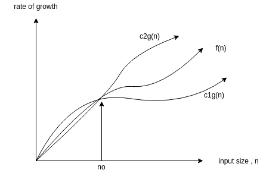

# implementations-of-algorithms-and-datastructures
This repository contains implementations of algorithms and data structures written in c++ and python.

# Introduction to Algorithms Analysis
- A data type in a programming language is a set of data with predefined values.
  - examples : integer,floating point,character,string,etc.
  - There are two data types:
    1. *System-defined data types* (primitive data types)
      - Data types that are defined by system.
      - examples : int,float,char,double,bool,etc.  
    2. *User-defined data types*
      - Data types that are defined by user.
      - examples : structures,classes.

- Data structure is a particular way of storing and organizing data in a computer so that it can be used efficiently
  - There are two types in data structures:
    1. *linear data structures* : elements are accessed in a sequential order but it is not necessary to store sequentially.
      - examples : linked lists,stacks,queues,etc.
    2. *non-linear data structures* : elements of this data structure are stored/accessed in a non-linear order.
      - examples : trees and graphs.

- Abstract data types(ADTs) : Data structures with their operations.
  - An ADT consists of two parts:
    1. Declaration of data
    2. Declaration of operations
  - examples : Linked lists,Stacks,Queues,Binary trees,etc.

- Algorithm : an algorithm is the step-by-step unambiguous instructions to solve a given problem.
  - Algorithm analysis helps us to determine which algorithm is the most efficient in terms of time and space consumed.
  - Running time analysis is the process of determining how processing time increases as the size of the problem(input size)       increases.
  -  
  
- Types of Analysis
  - *worst case* : input for which the algorithm takes long time
  - *best case* : input for which the algorithm takes least time
  - *average case* : input for which the algorithm takes average time
  
- Asymptotic notation 
  - 
  - Big-O notation
    - this notation gives the tight upper bound of the given function f(n).
    - represented as f(n) = O(g(n)) 
    - g(n) gives the maximum rate of growth for f(n) at larger values of n.
    - 
    - O(g(n))= {f(n):there exist positive constants c and n0 such that 0<=f(n)<=c*g(n) for all n>=n0}
    - O(nlogn) : 3n-100,2n-1,100,100n,etc.
    - n0 is called threshold for the given function , it cannot be zero because it is the input size
    - find upper bound for f(n)=n4+100n2+50
      - solution : 
      - n4+100n2+50 <= 2n4 for all n>=11 
      - n4+100n2+50 = O(n4) with c=2 & n0=11                                     
    - there is no unique set of values for n0 and c.
  - Omega notation
    - this notation gives the tighter lower bound of the given function f(n)
    - represented as f(n) = omega(g(n))
    - at larger values of n, the tighter lower bound of f(n) is g(n).
    - omega(g(n)):{f(n):there exist positive constants c & n0 such that 0<=c*g(n)<=f(n) for all n>=n0}
    - find lower bound for f(n)=5n2
      - solution: 
      - there exists c,n0 such that : 0<=cn2<=5n2 => cn2<=5n2 => c=5 and n0=1
      - there fore 5n2 = omega(n2) with c= 5 and n0=1
    - prove f(n) = 100n + 5 is not equal to omega(n2).
      - there exists c,n0 such that:0<=cn2<=100n+5
      - 100n+5 <= 100n+5n for all n>=1 = 105n
      - cn2 <= 105n => n(cn-105) <= 0
      - since n is positive => cn-105 <= 0 => n <= 105/c
      - contradiction: n cannot be smaller than a constant.
    - 2n = omega(n) , n3 = omega(n3), logn = omega(logn)
  - theta notation
    - this notation decides whether the upper and lower bounds of a given function (algorithm) are the same.
    - if the upper bound and lower bound give the same result,then the theta notation will also have the same rate of growth.
    - for example : f(n)=10n+n , its tight upper bound is O(n) and its tight lower bound is omega(n).
    - if the upper bound and lower bound are not the same then the rate of growth for theta case may be not the same.In this case, we need to consider all the possible time complexities and take average of those.
    - theta notation is defined as theta(g(n)) = {f(n):there exist positive constants c1,c2,n0 such that 0<=c1g(n)<=f(n)<=c2g(n) for all n>=n0 } 
    - g(n) is asymptotic tight bound for f(n). theta(g(n)) is the set of functions with the same order of growth as g(n).
    - 
    - find theta bound for f(n)=n2/2 - n/2
      - solution:  n2/5 <= n2/2 - n/2 <= n2 , for all , n>=2
      - n2/2 - n/2 = theta(n2) with c1 = 1/5 , c2 = 1 and n0 = 2
    - prove n is not equal to theta(n2)
      - c1n2 <= n <= c2n2 => only holds for : n<=1/c1.(contradiction)
    - prove n is not equal to theta(logn)
      - c1logn <= n <= c2logn => c2 >= n/logn - impossible
- properties of asymptotic notations
  - Transtivity : f(n) = theta(g(n)) and g(n) = theta(h(n)) => f(n) = theta(h(n)) valid for Big-O and Omega as well.
  - Reflexivity : f(n) = theta(f(n)) valid for Big-O and Omega
  - symmetry : f(n) = theta(g(n)) if and only if g(n) = theta(f(n)) , not valid for Big-O and Omega
  - Transpose symmetry : f(n) = O(g(n)) if and only if g(n) = omega(f(n))
  - if f(n) is in O(k.g(n)) for any constant k>0 , then f(n) is in O(g(n)).
  - if f(n) is in O(g(n)) and f1(n) is in O(g1(n)) , then (f+f1)(n) is in O(max(g(n),g1(n))).
  - if f1(n) is in O(g1(n)) and f2(n) is in O(g2(n)) , then f1(n)f2(n) is in O(g1(n)g2(n)).
- logarithms
  - logxy = ylogx               
  - logn=logn10
  - logxy = logx + logy
  - logkn = (logn)k
  - loglogn = log(logn)
  - logx/y = logx-logy
  - alogxb = xlogab
  - logxb = logxa / logba
- important formulae
  - arithmetic series
    - summation(k) for 1=<k<=n : 1+2+3+4+5+.......+n = n(n+1)/2
  - geometric series
    - summation(xk) for 0<=k<=n : 1+x+x2....+xn = x n+1-1 / x-1 (x != 1)
  - harmonic series
    - summation(1/k) for 1<=k<=n : 1 + 1/2 + 1/3 + 1/4 + .. + 1/n = logn (approx)
  - other important formulae
    - summation(logk) for 1<=k<=n =  nlogn(approx)
    - summation(kp) for 1<=k<=n : 1p+2p +...+ np = (1/p+1)np+1(apx)
- Master theorem for divide and conquer recurrences
  - this theorem can be used to determine the running time of divide and conquer algorithms.
  - first, try to find the recurrence relation for the problem
  - if the recurrence relation is of the form T(n) = aT(n/b) + theta(nklogpn) where a>=1,b>1,k>=0 and p is a real number, then:
    - if a>bk , then T(n) = theta(nlogba)
    - if a=bk ,
         1. if p>-1 , then T(n) = theta( nlogba logp+1n )
         2. if p=-1 , then T(n) = theta( nlogba loglogn )
         3. if p<-1 , then T(n) = theta( nlogba )
    - if a<bk ,
         1. if p>=0 , then T(n) = theta( nklogpn )
         2. if p<0 , then T(n) = O( nk )
- master theorem for subtract and conquer recurrences
    - T(n) is a function defined on positive n and having the property
      -   T(n) = c if n<=1
      -   T(n) = aT(n-b) + f(n) if n>1
    - for some constants c,a>0,b>0,k>=0 and function f(n). if f(n) is in O(nk) then
      -   T(n) = O(nk), if a<1
      -   T(n) = O(nk+1), if a=1
      -   T(n) = O(nkan/b) if a>1
         
      
