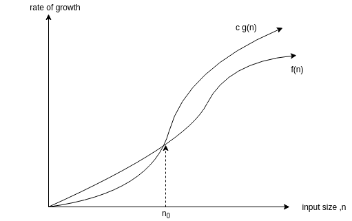

# implementation-of-algorithms-and-datastructures
This repository contains the implementations of algorithms and data structures written in c++ and python.

# Introduction to Algorithms Analysis
- A data type in a programming language is a set of data with predefined values.
  - examples : integer,floating point,character,string,etc.
  - There are two data types:
    1. *System-defined data types* (primitive data types)
      - Data types that are defined by system.
      - examples : int,float,char,double,bool,etc.  
    2. *User-defined data types*
      - Data types that are defined by user.
      - examples : structures,classes.

- Data structure is a particular way of storing and organizing data in a computer so that it can be used efficiently
  - There are two types in data structures:
    1. *linear data structures* : elements are accessed in a sequential order but it is not necessary to store sequentially.
      - examples : linked lists,stacks,queues,etc.
    2. *non-linear data structures* : elements of this data structure are stored/accessed in a non-linear order.
      - examples : trees and graphs.

- Abstract data types(ADTs) : Data structures with their operations.
  - An ADT consists of two parts:
    1. Declaration of data
    2. Declaration of operations
  - examples : Linked lists,Stacks,Queues,Binary trees,etc.

- Algorithm : an algorithm is the step-by-step unambiguous instructions to solve a given problem.
  - Algorithm analysis helps us to determine which algorithm is the most efficient in terms of time and space consumed.
  - Running time analysis is the process of determining how processing time increases as the size of the problem(input size)       increases.
  -  
  
- Types of Analysis
  - *worst case* : input for which the algorithm takes long time
  - *best case* : input for which the algorithm takes least time
  - *average case* : input for which the algorithm takes average time
  
- Asymptotic notation 
  - 
  - Big-O notation
    - this notation gives the tight upper bound of the given function f(n).
    - represented as f(n) = O(g(n)) 
    - g(n) gives the maximum rate of growth for f(n) at larger values of n.
    - 
    - O(g(n))= {f(n):there exist positive constants c and n0 such that 0<=f(n)<=c*g(n) for all n>=n0}
    - O(nlogn) : 3n-100,2n-1,100,100n,etc.
    - n0 is called threshold for the given function , it cannot be zero because it is the input size
    - find upper bound for f(n)=n4+100n2+50
      - solution : 
      - n4+100n2+50 <= 2n4 for all n>=11 
      - n4+100n2+50 = O(n4) with c=2 & n0=11                                     
    - there is no unique set of values for n0 and c.
  - Omega notation
    - this notation gives the tighter lower bound of the given function f(n)
    - represented as f(n) = omega(g(n))
    - at larger values of n, the tighter lower bound of f(n) is g(n).
    - omega(g(n)):{f(n):there exist positive constants c & n0 such that 0<=c*g(n)<=f(n) for all n>=n0}
    - find lower bound for f(n)=5n2
      - solution: 
      - there exists c,n0 such that : 0<=cn2<=5n2 => cn2<=5n2 => c=5 and n0=1
      - there fore 5n2 = omega(n2) with c= 5 and n0=1
    - prove f(n) = 100n + 5 is not equal to omega(n2).
      - there exists c,n0 such that:0<=cn2<=100n+5
      - 100n+5 <= 100n+5n for all n>=1 = 105n
      - cn2 <= 105n => n(cn-105) <= 0
      - since n is positive => cn-105 <= 0 => n <= 105/c
      - contradiction: n cannot be smaller than a constant.
    - 2n = omega(n) , n3 = omega(n3), logn = omega(logn)
    
      
      
